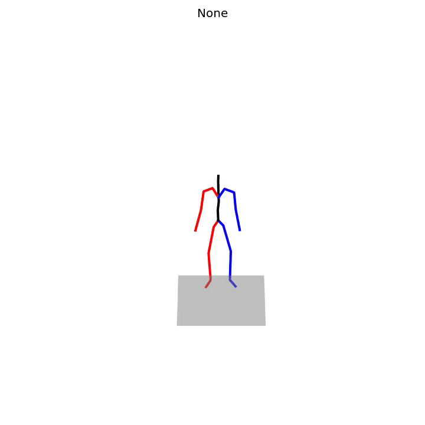
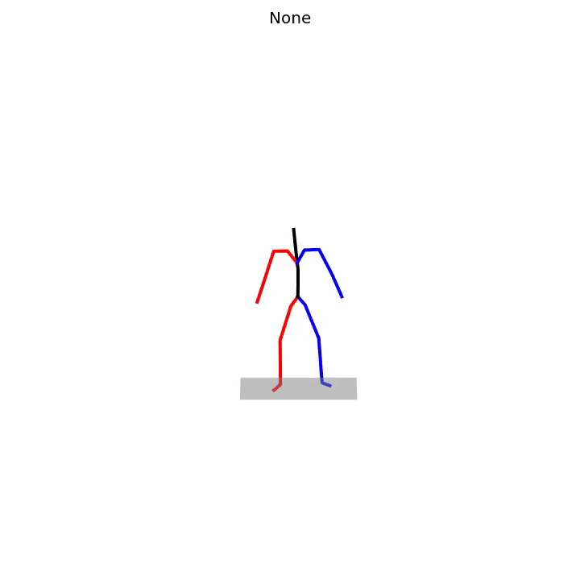
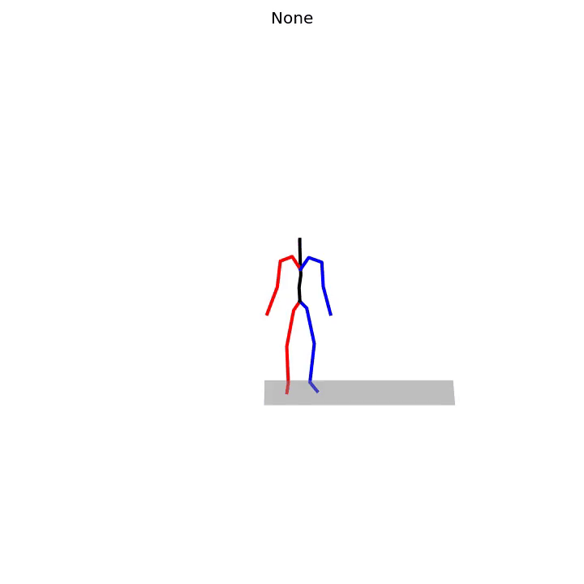
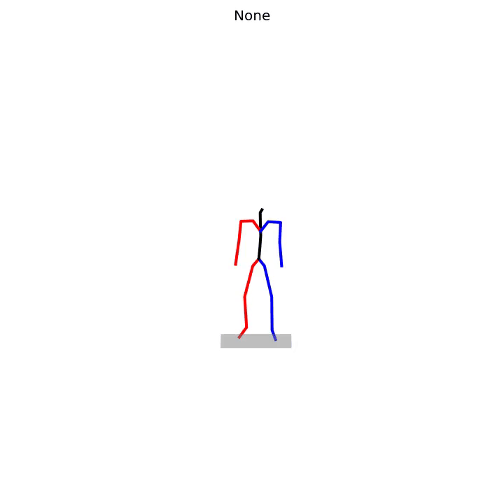
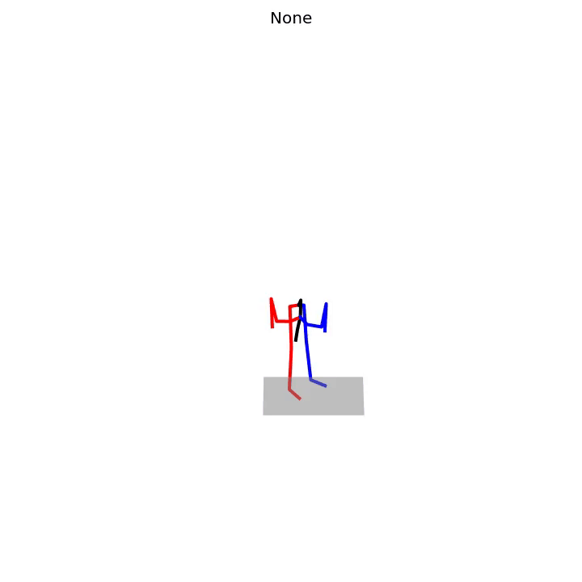
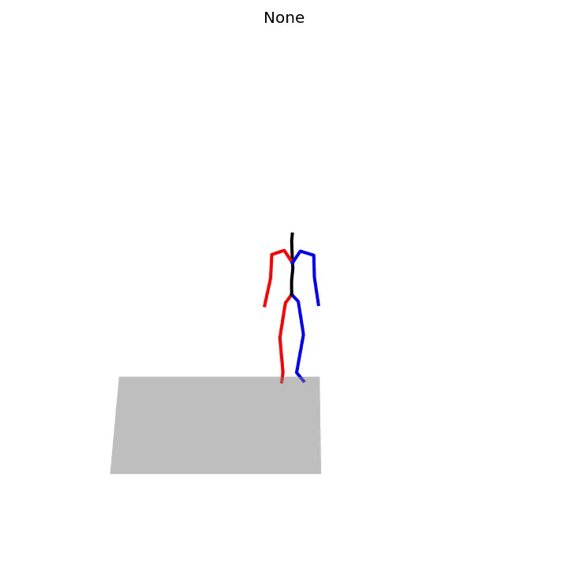
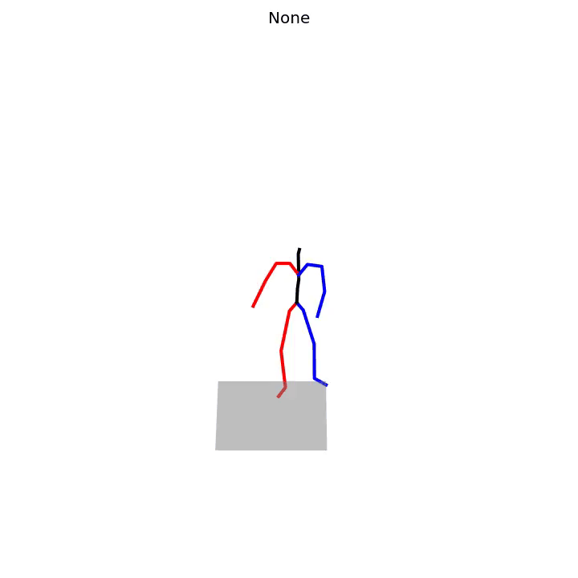
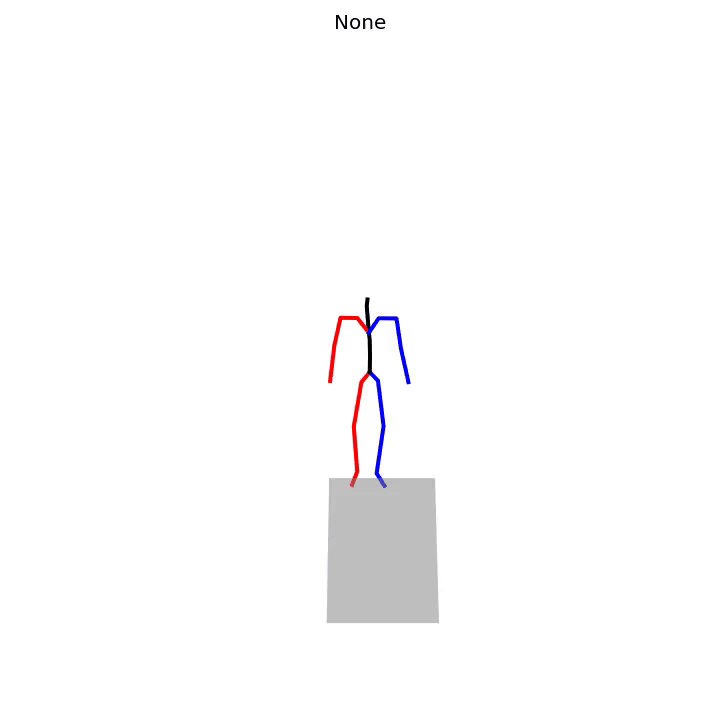
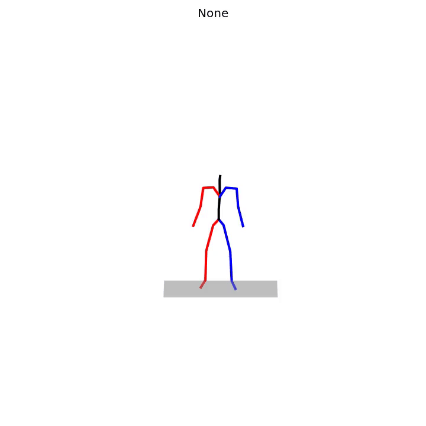

# Taming Motion
Trying an idea of learning a motion codebook from a dataset of human motion and learning the distribution of the
codebook using a masked auto-encoding approach compared to an autoregressive transformer based approach.

## Requirements
Create and activate a [conda](https://conda.io/) environment as follows:
```
conda env create -f environment.yaml
conda activate taming-motion
pip install git+https://github.com/nghorbani/body_visualizer.git
pip install git+https://github.com/MPI-IS/configer
pip install git+https://github.com/MPI-IS/mesh.git
pip install -e .
```
Note: ensure `libboost-dev`, `gcc`, `g++` are installed on your system.

You will need to either download and process your own copy of HumanML3D or mount:
```angular2html
'/media/varora/LaCie/Datasets/HumanML3D/HumanML3D/'
```

## TO-DO
- [x] Download HumanML3D dataset
- [x] Visualize HumanML3D dataset
- [x] Overfit a VQVAE codebook on a single sample
- [ ] Visualize reconstructions of overfitted VQVAE
- [x] Train a VQVAE on whole HumanML3D dataset
- [x] Visualize reconstructions of model trained on whole HumanML3D dataset
- [ ] Train a masked autoencoder on top of the learnt motion codebook

# Results/Updates
```angular2html
https://gitlab.inria.fr/varora/taming-motion/-/issues/2
```

## Notes
- Issue:
    ```angular2html
    ModuleNotFoundError: No module named 'mpl_toolkits'
    ```
    Solution:
    ```angular2html
    pip install basemap
    ```
- Issue
  ```angular2html
  ax.lines = []
  AttributeError: can't set attribute
  ```
  Solution:
  ```angular2html
  conda env create -f environment_t2m.yml 
  conda activate T2M-GPT
  ```
  
## Dataset
Using the [HumanML3D](https://openaccess.thecvf.com/content/CVPR2022/papers/Guo_Generating_Diverse_and_Natural_3D_Human_Motions_From_Text_CVPR_2022_paper.pdf) 
data: a 3D human motion-language dataset that originates from a combination of HumanAct12 and Amass dataset. Follow the 
instructions in the [HumanML3D github repo](https://github.com/EricGuo5513/HumanML3D) to download and process the dataset.

Data directory: `/media/varora/LaCie1/Datasets/HumanML3D/`









